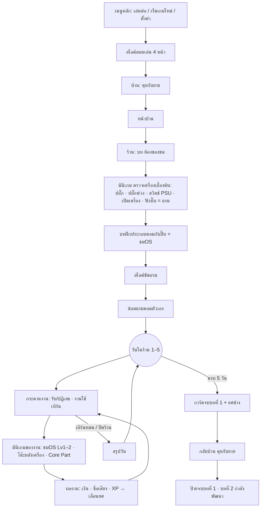
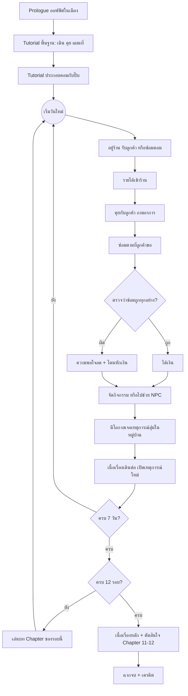

# GAME_LOOP.md — ลูปเกมทั้งเกม (วัน → บท 5 วัน → 12 บท → ฉากจบ)

> [Claude 2 ต.ค. 2569] · เขียนจาก flowchart ลูปเกมที่ทีมส่งมา + เอกสารที่มีอยู่ + โค้ดจริงใน repo (commit `60a0084`)
> ลูป **งานซ่อม 1 งาน** อยู่ใน `REPAIR_FLOW.md` (5 Scene) · เอกสารนี้คือ **ลูปใหญ่ที่ครอบงานซ่อม** ซึ่งยังไม่มีเอกสารไหนเขียนไว้
> ⚠️ **6 ต.ค. — ร่างรูปแบบเกมใหม่ `GAME_REDESIGN.md`** (กระดานงาน · ความยาก 3 ระดับ · เครื่องมือใช้ได้จริง · บทลงโทษ · hints · โหมด · upgrade) — ส่วนที่ขัดกับเอกสารนี้ให้ถือร่างใหม่
> **ลูกค้า Week 1 + วิธีแก้ใน Inspector:** `WEEK1_CUSTOMERS.md`
> **วิธีลองลูป 7 วัน:** เล่นเควสต์จนซ่อมแรมเสร็จ → ลูกค้าคนแรก (event บังคับ) เข้ามาเอง หรือกด F1 → "ลูปร้าน: ข้ามเควสต์" · การ์ดงานขึ้นมุมขวาในบ้าน/ห้อง
> สถานะ: ✅ มีในโค้ดแล้ว · 🟡 มีบางส่วน · ⬜ ยังไม่มี

---

## 0. สถานะจริงตอนนี้ (10 ต.ค. 2569) — อ่านส่วนนี้ก่อน

> ข้อ 1–9 ด้านล่างเป็นแผนเดิม (2–6 ต.ค.) · ตารางสถานะในข้อ 3 · 7 · 8 อัปเดตแล้ว · ตัวเลขละเอียด (เวลา · งาน · ค่าแรง) ดู `LEVEL_DESIGN.md` (ข้อ 8.5 = สถานะโค้ดล่าสุด)

**เล่นได้ตั้งแต่ต้นจนจบบทที่ 1** (= เดโมที่ใช้ส่ง/ทำเล่ม):

| เรื่อง | ตอนนี้ (โค้ดจริง) |
|---|---|
| หน่วยเวลา | **เทิร์น** แบบ Volcano Princess · 1 เทิร์น = ช่อง 30 นาที · วันละ 16 เทิร์น · HUD "12 เทิร์น · บทที่ 1 · วันที่ 2/5 · อีก 3 วันจบบท" (`TimeSystem.show_clock = true` กลับเป็นนาฬิกาได้) |
| 1 บท | **5 วัน** (= 1 สัปดาห์ในโค้ด) · แผนเดิม 7 วัน/รอบ เลิกใช้ |
| จบเดโม | `DayLoop.demo_shifts = 5` → จบบทที่ 1 → บท `Chapter1End.txt` → ป้ายจบบท |
| ยศช่าง | ✅ 5 ยศ (`EconomyConfig.rank_xp` 0/500/1500/3500/7000) · แถบ XP ใต้ HUD · ป้าย "เลื่อนขั้น!" |
| เดินทาง | point-and-click ทั้งเกม · แผนที่ 5 ที่ (บ้าน · หน้าบ้าน · ร้าน · ตลาด · เมือง=ล็อก) กดแล้วไปทันที · ไม่มีตัวละครเดิน |
| ตลาด | ฉากกด แผง 3 ร้าน · หน้าต่างร้านค้า (ยังไม่มีของขาย · เพิ่มได้ด้วย `ShopItem`) |
| Save | ✅ `SaveGame` (`user://save.json`) autosave + ปุ่มบันทึก · เมนูหลัก "เล่นต่อ" |
| เสียง | ✅ เพลง 3 ชุด + jingle · เสียงประกอบ · บี๊บ BIOS (`AUDIO.md`) |
| ยังไม่มี | ของขายในตลาด · เมือง · บทที่ 2–12 แบบเล่นได้ (ไฟล์บทมีครบ) · เหตุการณ์สุ่ม/ช่วย NPC · ภาพฉากจบ 4 แบบ · ภาพจริงแทนภาพที่สร้างด้วยโค้ด (`ASSET_STATUS.md`) |

---

## 1. ภาพรวม 3 ชั้น

| ชั้น | หน่วย | ในเกม | จบเมื่อ |
|---|---|---|---|
| วัน | 1 วัน = 3 ช่วง (เช้า · เที่ยง · เย็น) | ร้านซ่อม → ซ่อม → กิจกรรมหมู่บ้าน | ครบช่วงเย็น |
| รอบ | 1 รอบ = **5 วัน** (10 ต.ค. · เดิม 7) = 1 บท (Chapter) = 1 เดือนในเนื้อเรื่อง | เหตุการณ์ประจำบทเกิดระหว่างรอบ · ท้ายรอบเล่นบทของ Chapter | ครบ 5 วัน |
| ทั้งเกม | **12 รอบ** = 12 Chapter = 1 ปีในเนื้อเรื่อง | Chapter 11 ตัดสินใจเส้นทาง → Chapter 12 → Epilogue | ครบ 12 รอบ → ฉากจบ |

> ทำไม 7 วัน = 1 เดือน: บท `Chapter1…12` เดินตามเดือน (Chapter 10 = ตุลาคม · Chapter 12 = "ครบหนึ่งปี") แต่ถ้าเล่น 30 วันต่อเดือนจะยาวเกินสำหรับเกมนี้ จึงย่อ 1 เดือนเหลือ 7 วันเล่น (ตรงกับ acceptance ของการ์ด Time System ใน ClickUp)

---

## 2. Flow (ตาม flowchart ของทีม)

ภาพ flowchart ต้นฉบับของทีมตัดหัวด้านบนไป (ไม่เห็นช่วงก่อน "Stay in shop") ช่วง Prologue → Tutorial ในแผนภาพนี้เติมจากเควสต์จริงใน `Resources/main.tres`

---

## 3. 1 วัน — 3 ช่วงเวลา

| ช่วง | ในเกม | ขั้นใน flowchart | ระบบที่ใช้ | สถานะ |
|---|---|---|---|---|
| เช้า | เปิดร้าน ลูกค้าเข้ามา 1 คน | อยู่ร้าน · คุยกับลูกค้า ถามอาการ | `DayLoop` การ์ดงาน (บ้าน/ห้อง) → บท `Assets/Dialog/Customer/*.txt` | ✅ กระดานงานหลายใบ (รับ/ปฏิเสธ · งานใช้เทิร์น) + บทลูกค้า · ยังไม่มีซีน ShopCounter แยก |
| เที่ยง | ซ่อม: ถอด → Core Part / Normal Part → ประกอบ → bench test | ซ่อมตามที่ขอ · ตรวจว่าถูกทุกอย่าง | `DayLoop` เปิดมินิเกม Core Part ของงานนั้น | ✅ Core Part 5 ตัว · ขมOS งานบนจอ Lv1 10 แบบ + Lv2 · โต๊ะหลังเครื่อง Lv2 · S2/S4 ยังไม่มี |
| เที่ยง (จบงาน) | ส่งเครื่อง รับเงิน หรือโดนหัก | ได้เงิน / ความพอใจลด + หักเงิน | `GameState.record_repair` → การ์ดผลงาน | ✅ placeholder |
| เย็น | ออกไปหมู่บ้านผ่านแผนที่ · ช่วย NPC · จัดกิจกรรม · เหตุการณ์สุ่ม | จัดกิจกรรม/ช่วย NPC · เหตุการณ์สุ่ม · เนื้อเรื่องเดิน | `map.tscn` · Market · `EventManager` · Dialog | 🟡 แผนที่ไปได้ 4 ที่ (เมืองล็อก) · ตลาดมีหน้าร้าน (ยังไม่มีของ) · ไม่มีเหตุการณ์สุ่ม |
| จบวัน | เข้านอน → วันถัดไป · autosave | ครบ 7 วัน? | การ์ดเย็น "เข้านอน" → `EventManager.end_day()` → `TimeSystem.change_day()` · SaveManager | ✅ ปิดร้าน → วันถัดไป · 5 วัน/บท · autosave |

### ผลของการซ่อม (กล่อง "Check if everything is correct")

ใช้คะแนน 0–100 ที่หน้าสรุปของทุก Core Part คิดอยู่แล้ว (`phase_summary.gd` · ⭐ ที่ 60 / 80 / 95)

| ผล | เงื่อนไข | เงิน | ความพอใจ | XP |
|---|---|---|---|---|
| ถูกทุกอย่าง | คะแนน ≥ 80 และ bench test ผ่าน | ค่าซ่อมเต็ม (+ทิปเมื่อ ⭐⭐⭐) | +5 | ตามการ์ด Technician Rank |
| ผ่านแบบมีจุดพลาด | 60–79 | ค่าซ่อมเต็ม | 0 | ×0.6 |
| ผิด | < 60 หรือทำของเสีย (การ์ดไหม้ · ข้อมูลลูกค้าหาย) | **หักเงิน** (ค่าของที่เสีย) | −10 | ×0.4 |

✅ ทำแล้ว (5 ต.ค.) — `GameState.record_repair()` ถูกเรียกเองตอนจบมินิเกม Core Part ทุกตัว (`PartMinigame._report_repair` อ่าน `total` จากหน้า SUMMARY + `repair_damaged()` ของแต่ละ Part) · ตัวเลขทั้งหมดอยู่ใน `Resources/Balance/economy.tres` (`EconomyConfig`) — **ค่าตอนนี้เป็นค่าทดลอง ทีมต้องปรับ** · ซ่อมเสร็จ 1 งาน = เวลาเดิน 1 ช่วง (ไม่เกินเย็น)

---

## 4. 1 รอบ (7 วัน) = 1 Chapter

| สิ่งที่เกิด | เมื่อไร | สถานะ |
|---|---|---|
| ลูกค้าเคสใหม่ตามระดับความยากของรอบ (ดูข้อ 5) | ทุกเช้า | 🟡 Week 1 กำหนดครบ 7 วันใน `Resources/Week/week1.tres` (ทุกคนมีเหตุผลที่มา · วันที่ 1 = event บังคับ) · รอบ 2+ สุ่มจาก `random_pool` · ดู `WEEK1_CUSTOMERS.md` |
| เหตุการณ์ประจำบท (NPC มาขอให้ช่วย · ไฟดับ · งานโรงเรียน ฯลฯ) | กลางรอบ วันที่ 3–5 ช่วงเย็น | ⬜ |
| บท Chapter ของรอบ (`Assets/Dialog/ChapterN*.txt`) | นอนคืนวันที่ 7 → เปิดบทของรอบถัดไป (รอบ 1 = Chapter 1 ในเควสต์) | ✅ `GameState._on_week_ended` · เล่นผ่าน `EventManager.play_story_dialog` (ไม่ไปเดินเควสต์หลัก) |
| สรุปรอบ: เงิน · ความพอใจเฉลี่ย · ยศ | วันสุดท้ายของบท | ✅ การ์ดสรุป/จบบท (งาน · รายได้ · ความพอใจ · ยศ + XP) |

### บทของแต่ละรอบ (มีไฟล์ครบแล้ว)

| รอบ | ไฟล์บท | เรื่อง |
|---|---|---|
| 1 | `Chapter1ReturnHome.txt` | กลับบ้านยาย |
| 2 | `Chapter2Rest.txt` | เจอคอมเก่า Pentium II |
| 3 | `Chapter3DecorateHouse.txt` | จัดบ้านเป็นร้าน |
| 4 | `Chapter4Start.txt` | เปิดร้าน ลูกค้าคนแรก |
| 5 | `Chapter5Quiet.txt` | ร้านเงียบ |
| 6 | `Chapter6Happy.txt` | ร้านเริ่มคึกคัก |
| 7 | `Chapter7Teaching.txt` | สอนคอมพื้นฐาน |
| 8 | `Chapter8Problem.txt` | ไฟดับ ไม่มี UPS |
| 9 | `Chapter9School.txt` | ผอ.เชิญไปสอนที่โรงเรียน |
| 10 | `Chapter10Village.txt` | ออกบูธงานหมู่บ้าน (ตุลาคม) |
| 11 | `Chapter11Path.txt` | บริษัทเก่าชวนกลับ → **ตัดสินใจเส้นทาง** |
| 12 | `Chapter12Year.txt` | ครบหนึ่งปี |
| จบ | `Epilogue.txt` | ฉากจบ |

---

## 5. ไต่ระดับความยาก — Core Part ปลดล็อกตามรอบ

ตอบ feedback อาจารย์ "เข้าเกมมาเจอขัดแรมทันที ควรเรียงง่ายไปยาก" และผูกกับยศช่าง 5 ระดับ

| รอบ | Core Part ที่ลูกค้าเริ่มเอามา | ยศที่ควรได้ตอนจบช่วง | มินิเกม |
|---|---|---|---|
| 1–2 | RAM | ช่างมือใหม่ → ช่างฝึกหัด | ✅ `part_ram.tscn` |
| 3–4 | + Mainboard + CPU | ช่างฝึกหัด | ✅ `part_mainboard.tscn` |
| 5–6 | + GPU + จัดสาย | ช่างประจำหมู่บ้าน | ✅ `part_gpu.tscn` |
| 7–9 | + Front Panel + Dual Channel | ช่างเชี่ยวชาญ | ✅ `part_front_panel.tscn` |
| 10–12 | + BIOS + ลง OS + อัปเกรด | ช่างระดับมือโปร | ✅ `part_bios.tscn` |

ครั้งแรกที่เจอ Part ใหม่ ปิ๊บสอนเต็ม (ทุก Part มี BRIEFING อยู่แล้ว) · ครั้งถัดไปข้ามบทสอนได้

---

## 6. ฉากจบ

ตัดสินใจใน Chapter 11 (ทางเลือกในบท) + คะแนนสะสมทั้งเกม

| ฉากจบ | เงื่อนไข |
|---|---|
| 1 อยู่หมู่บ้าน ขยายร้าน (Success) | ปฏิเสธบริษัทเก่า + ความพอใจเฉลี่ย ≥ 70 |
| 2 กลับเมือง มิ้นดูแลร้านแทน | รับงานบริษัทเก่า |
| 3 ปรับร้านเป็น Coworking | เลือกทางที่ 3 + ยศ ≥ ช่างเชี่ยวชาญ |
| ร้านปิด (Failure) | ความพอใจเฉลี่ย < 40 หรือเงินติดลบท้ายรอบ 12 |
| พิเศษ | ยศช่างระดับมือโปร (ตามการ์ด Technician Rank) |

---

## 7. ข้อมูลที่ต้องเก็บ (SaveManager)

| ข้อมูล | ใช้ที่ | มีแล้วไหม |
|---|---|---|
| `week` (1–12) · `day` (1–7) · `period` | ลูปเวลา | ✅ `TimeSystem.shift` (วันที่ 1–60) · `current_minute` · save แล้ว |
| `money` | รายได้ · หักเงิน · ซื้อของ | ✅ save แล้ว |
| `satisfaction_history` (คะแนนงานซ่อมทุกงาน) | ความพอใจเฉลี่ย · ฉากจบ | ✅ save แล้ว |
| `xp` · `rank` · `part_clears` | ยศช่าง · ปลดล็อก Part | ✅ `xp` · `rank()` · `part_clears` · save แล้ว |
| `event_step` ของเควสต์หลัก | `EventManager` | ✅ save แล้ว (`SaveGame` quest) |
| `story_flags` (ทางเลือก Chapter 11 · NPC ที่ช่วยแล้ว) | ฉากจบ · เหตุการณ์ | 🟡 `GameState.story_flags` มีที่เก็บ · บทพูดยังตั้งธงไม่ได้ (`ch11_choice`) |

---

## 8. ของที่มีแล้วในโค้ด เทียบกับลูป

| ระบบ | ไฟล์ | ใช้ในลูปตรงไหน | สถานะ |
|---|---|---|---|
| เควสต์ทีละขั้น (Dialog / Minigame / Tutorial / Scene) | `EventManager` · `QuestStep` · `Resources/main.tres` | ขับเนื้อเรื่องและเปิดมินิเกม | ✅ ใช้ได้ · เควสต์จบที่ซ่อมแรมคอมตัวเอง (ไม่คิดเงิน) แล้ว `DayLoop` รับช่วงต่อด้วยลูกค้าคนแรก |
| บทพูด + ตัวเลือก | `DialogScene` · `Assets/Dialog/*.txt` | บท Chapter · คุยลูกค้า · NPC | ✅ |
| ตัวละคร + สีหน้า | `Scene/Global.tscn` `_CharacterMap` | บทพูด | ✅ 12 ตัว · สีหน้าเรียกด้วย `"ชื่อ:อารมณ์"` เช่น `"ขม:surprised"` |
| เวลา เช้า/เที่ยง/เย็น + วัน | `time_system.gd` | ลูปวัน | ✅ (10 ต.ค.) วันละ 16 เทิร์น · 5 วัน/บท · สัญญาณ `shift_started` `week_ended` · HUD "N เทิร์น · บทที่ x · วันที่ y/5" + เงิน + แถบยศ |
| แผนที่ | `map.tscn` | ช่วงเย็นออกไปหมู่บ้าน | ✅ (10 ต.ค.) ทำใหม่ไม่ต้องเดิน · การ์ด 5 ที่ · ปิ๊บอธิบาย |
| ตลาด | `Market.tscn` (ฉากกด · `MarketStall` · `ShopPanel`) | ซื้ออะไหล่/ของ | 🟡 หน้าร้านค้ามีแล้ว · ยังไม่มีของขาย |
| มินิเกม Core Part 5 ตัว | `Scene/MiniGame/Part*/` | ช่วงซ่อม | ✅ เล่นได้ครบ · เปิดจากการ์ดงานของ `DayLoop` · ส่งคะแนนเข้า `GameState` |
| Tutorial ประกอบคอม | `tutorial_assembly.tscn` | ก่อนรอบ 1 | ✅ อยู่ในเควสต์แล้ว |
| สไลด์สอน | `Tutorial.tscn` | สอนเล่นครั้งแรก | ✅ BASIC_START · RAM_CLEANING |
| งานซ่อม 5 Scene · RepairManager | — | ช่วงเช้า–เที่ยง | ⬜ |
| เงิน · ความพอใจ · XP · ฉากจบ | `Scripts/Core/game_state.gd` (`GameState`) · `Scripts/Core/day_loop.gd` (`DayLoop`) · `EconomyConfig` | ทั้งลูป | 🟡 ✅ เงิน/ความพอใจ/XP · `decide_ending()` + Epilogue + การ์ดฉากจบ (ข้อความ) · ยังไม่มีภาพฉากจบ 4 แบบ/เครดิต |
| ยศ · Save · เสียง | `GameState.rank()` · `SaveGame` · autoload `Audio` | ทั้งลูป | ✅ (10 ต.ค.) ยศ + แถบ XP · บันทึกเกม · เพลง/เสียงสร้างด้วยโค้ด |

---

## 9. ลำดับทำให้เล่นจบลูปได้เร็วที่สุด

1. ✅ (5 ต.ค.) **เชื่อม 4 Core Part เข้าเควสต์** ต่อจาก Part RAM ใน `main.tres` — เล่นเนื้อเรื่องจบทั้ง 5 Part ได้ทันที (ไม่ต้องรอระบบอื่น)
2. ✅ (5 ต.ค.) **TimeSystem: 7 วัน/รอบ · 12 รอบ** + สัญญาณ `week_ended` → เปิดบท Chapter ของรอบ
3. ✅ (5 ต.ค.) **เงิน + ความพอใจ** (autoload เล็ก ๆ เก็บค่าจาก `phase_summary.total`) + แสดงใน HUD
4. ✅ (10 ต.ค.) **Save** — `SaveGame`
5. 🟡 (5 ต.ค.) **S1 ShopCounter แบบง่าย** — ทำเป็นการ์ด `DayLoop` (ลูกค้า → อาการ → รับงาน → มินิเกม → ผลงาน → เย็น → นอน) · เหลือทำซีน/กราฟิกจริง
6. ช่วงเย็น: เหตุการณ์ประจำบทผ่าน `QuestStep` (ใช้ระบบเควสต์ที่มีอยู่)
7. 🟡 ยศช่าง ✅ (10 ต.ค.) · ฉากจบ 3+1 แบบ ยังเป็นข้อความ

---

## ประวัติเอกสาร

| วันที่ | การเปลี่ยนแปลง |
|---|---|
| 2 ต.ค. 2569 | สร้างเอกสาร — ลูปเกมทั้งเกมตาม flowchart ของทีม เทียบกับโค้ดจริง |
| 5 ต.ค. 2569 | ทำข้อ 9.1–9.3 บน `Test/Beta_version1`: TimeSystem 7 วัน/รอบ · 12 รอบ · `GameState` (เงิน · ความพอใจ · XP · ฉากจบ) + `economy.tres` · Debug F1 มีปุ่มเดินเวลา · ทดสอบ `Test/loop_test.tscn` (Godot 4.7.2 headless ผ่าน) |
| 5 ต.ค. 2569 (2) | ลูป 7 วันเล่นได้ครบ: `DayLoop` autoload (การ์ดงาน/ผลงาน/เย็น/สรุปรอบ/ฉากจบ แบบ placeholder) · บทลูกค้า 5 ไฟล์ `Assets/Dialog/Customer/` · ย้าย 4 Part ออกจากเควสต์มาเป็นงานรายวัน · Debug F1 "ลูปร้าน: ข้ามเควสต์" · `Test/loop_test.tscn` เล่น 7 วันอัตโนมัติ ผ่าน 37/37 |
| 5 ต.ค. 2569 (3) | Week 1 แบบ data-driven: `CustomerCase` / `WeekPlan` resource แก้ใน Inspector · ลูกค้า 7 คนมีเหตุผลที่มาทุกคน · วันที่ 1 ลุงอำนวย (คอม 6 ปีไม่เคยทำความสะอาด) เป็น event บังคับ · DayLoop เป็นซีน `Scene/Core/day_loop.tscn` · งานในเควสต์ไม่คิดเงิน · `Test/loop_test.tscn` 53/53 |
| 5 ต.ค. 2569 (4) | QTE ระบบกลาง (`QteRunner` · `QteSpec`) + RAM INSTALL ใช้ QTE จังหวะ/กดค้าง — ลูกค้าวันที่ 1 และ 6 ได้เล่น · รายละเอียด `CORE_PART_QTE.md` ข้อ 9 |
| 5 ต.ค. 2569 (5) | ปุ่มข้าม Tutorial (มินิเกมประกอบคอม · ซ่อมแรมในเควสต์ · สไลด์) · หลัง Tutorial มีบทพัก (ยายเรียกกินขนม) → เวลาหมุน 30 นาทีใน 1 วิ → ลูกค้าคนแรก · นาฬิกา HH:MM ใน HUD (`TimeSystem.current_minute` · `advance_minutes` · `DayLoop.time_skip`) · `loop_test` 61/61 |
| 5 ต.ค. 2569 (6) | เช็ก error + ดักโค้ดใหม่: `DialogUtil` (บทว่าง/หาย) · `play_story_dialog` คืน bool · DayLoop watchdog ปลดล็อกถ้าค้าง 3 วิ · มินิเกมจบซ้ำไม่ได้ · QTE ค่าผิดใน Inspector ถูกแก้ตอนเล่น + เตือน · `Test/guard_test.tscn` 26/26 · warning ของ GDScript ในไฟล์ใหม่เหลือ 0 |
| 6 ต.ค. 2569 | ชี้ไป `GAME_REDESIGN.md` (ร่าง v2 จาก feedback 17 ข้อ) |
| 10 ต.ค. 2569 | เพิ่มข้อ 0 สถานะจริง: เล่นจบบทที่ 1 ได้ · บทละ 5 วัน · เวลาเป็นเทิร์น · ยศช่าง · แผนที่ไม่ต้องเดิน · ตลาด + หน้าร้าน · Save · เสียง · อัปเดตตารางสถานะข้อ 3/4/7/8/9 |
