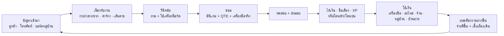

# GAME_REDESIGN.md — ร่างรูปแบบเกมใหม่ (v2)

> [Claude 6 ต.ค. 2569] · ร่างจาก feedback รอบ 6 ต.ค. (รายการข้อ 0) · อ้างอิงโค้ดจริงที่ `Test/Beta_version1` commit `f5a16f4`
> **เอกสารนี้แทนที่ส่วน "เกมเล่นยังไง"** ของ `GAME_LOOP.md` · `REPAIR_FLOW.md` · `REPAIR_SHOP_SYSTEM.md` ส่วนที่ขัดกันให้ถือเอกสารนี้ · ของเดิมยังใช้เป็นสเปกรายละเอียดได้
> สถานะ: **ร่าง รอทีมเลือก** — ข้อที่ต้องตัดสินใจอยู่ข้อ 15
> ⚠️ **7 ต.ค. มีร่างต่อยอดที่แทนบางข้อ:** `LEVEL_DESIGN.md` (แทนข้อ 2 · 4 · 5 — เวลา · ความยาก · level design) · `SHOP_UPGRADE.md` (แทนข้อ 10.2–10.3 — upgrade · ใช้เงิน) · `ECONOMY_ENERGY.md` (ราคา/เงินทั้งหมด · พลังงาน · ต่อรอง)

---

## 0. Feedback ที่ต้องตอบ → อยู่ข้อไหน

| # | Feedback | ปัญหาตอนนี้ | ตอบในข้อ |
|---|---|---|---|
| 1 | รูปเดิม | — (ต้องยืนยันความหมาย) | 12 · 15 |
| 2 | ปรับ UI | การ์ดสร้างจากโค้ด หน้าตาไม่เหมือนกันทุกหน้า · HUD กระจาย | 11 |
| 3 | BIOS เป็น window | BIOS เป็นภาพนิ่งในฉาก ไม่รู้สึกเหมือนใช้คอมจริง | 11.3 |
| 4 | เครื่องมือต้องใช้ได้จริง | เครื่องมือเป็นปุ่มเลือกในถาด เลือกแล้วผลขึ้นเอง ไม่ได้ "ใช้" | 6 |
| 5 | บทลงโทษเมื่อทำผิด · ระบบคะแนน · penalty | หักคะแนนในหน้าสรุปอย่างเดียว ผลไม่ตามไปถึงเงิน/ลูกค้า/เวลา | 7 |
| 6 | ตัวละครหันทางเดียวกัน | ส่วนใหญ่หัน ¾ ขวา แต่ยาย · ปิ๊บ หันหน้าตรง · ในบทไม่มีกติกาว่าใครหันไหน | 12.1 |
| 7 | ขนาดให้สื่อความเป็นจริง | แรม (600px) ยาวพอ ๆ กับการ์ดจอ (620px) · CPU 180px ทั้งที่ของจริง 4 ซม. | 12.2 |
| 8 | ปัญหาจะมาหาเรายังไง → challenge | ลูกค้ามาวันละ 1 คนตายตัว ไม่มีอะไรให้เลือก ไม่มีแรงกดดัน | 3 |
| 9 | โหมด | มีแค่เนื้อเรื่อง | 9 |
| 10 | การให้ hints | ปิ๊บพูดเองตลอด ไม่ต้องคิด | 8 |
| 11 | งานง่าย / ปานกลาง / ยาก · level design | ทุกงานยากเท่ากัน · ต่างกันแค่ Part | 4 · 5 |
| 12 | progression | XP มีแต่ไม่ได้ใช้ · ยศยังไม่มี | 10 |
| 13 | replay? | เคสตายตัว เล่นซ้ำเหมือนเดิมทุกครั้ง | 9.2 |
| 14 | minigame แยก | มินิเกมเข้าได้ทางเควสต์/Debug เท่านั้น | 9.1 |
| 15 | cycle ที่ทำให้สนุก · **ได้เงินแล้วไม่รู้จะไปทำอะไร** | เงินขึ้นอย่างเดียว ไม่มีที่ใช้ | 1 · 2 · 10 |
| 16 | ระบบ upgrade | ไม่มี | 10.2 |
| 17 | ระบบข้อจำกัดผู้เล่น | ไม่มีอะไรจำกัด รับงานได้ไม่อั้น ไม่มีเวลาบีบ | 2 |

---

## 1. Cycle หลัก — ทำไมผู้เล่นอยากเล่นต่อ



| วง | ระยะ | สิ่งที่ผู้เล่นได้ทุกรอบ |
|---|---|---|
| วงเล็ก — 1 งาน | 3–10 นาที | แก้โจทย์ได้ · ดาว · เงินเข้า · ลูกค้าพูดขอบคุณ |
| วงกลาง — 1 วัน | 15–25 นาที | เลือกว่าจะรับงานไหนในเวลาที่จำกัด · จ่ายของ · ซื้อของ |
| วงใหญ่ — 1 รอบ (7 วัน) | ~2 ชม. | เป้าหมายรอบ (ข้อ 2.3) · บท Chapter · ปลดล็อกของใหม่ |
| ทั้งเกม — 12 รอบ | ~20 ชม. | ยศช่าง · ร้านโตขึ้นให้เห็น · โครงการหมู่บ้าน · ฉากจบตามที่เลือก |

**คำตอบของ "ได้เงินแล้วไม่รู้จะทำอะไร":** เงินต้องไหลออก 4 ทาง (ข้อ 10.3) และ **ทุกทางต้องเปลี่ยนการเล่นให้เห็น** — ซื้อเครื่องมือแล้วมีปุ่มใหม่ในถาด · ขยายร้านแล้วรับงานได้มากขึ้น · ลงทุนหมู่บ้านแล้วมีลูกค้ากลุ่มใหม่/ฉากจบใหม่

---

## 2. ข้อจำกัดของผู้เล่น (สร้างการตัดสินใจ)

ไม่มีข้อจำกัด = ไม่มีการเลือก = ไม่สนุก · ใช้ 5 อย่าง แต่ละอย่างบีบคนละแบบ

| ข้อจำกัด | กติกา | ทำให้ผู้เล่นต้องคิดเรื่อง | ปลดด้วย |
|---|---|---|---|
| **เวลา** | 1 วัน 08:00–20:00 = **12 ชม.** ทุกการกระทำกินนาทีในเกม (ตารางล่าง) | รับกี่งาน · งานไหนคุ้มเวลา | เครื่องมือดีขึ้น (ทำเร็วขึ้น) · มิ้นมาช่วย (เนื้อเรื่อง) |
| **ช่องรับเครื่อง** | ชั้นวางเริ่ม **3 ช่อง** · เต็มแล้วรับเพิ่มไม่ได้ | รับงานใหญ่ 1 งานหรืองานเล็ก 3 งาน | ซื้อชั้นเพิ่ม 5 → 8 |
| **เงินสด** | อะไหล่ต้องซื้อก่อนเปลี่ยน · มีค่าใช้จ่ายประจำรอบ | สต็อกของไว้หรือสั่งเมื่อใช้ | ทำงานดี ได้ทิป |
| **อุปกรณ์** | ทำงานบางแบบไม่ได้ถ้าไม่มีเครื่องมือ (เช่นไม่มี PSU tester = วินิจฉัยพาวเวอร์ไม่ได้) | ซื้ออะไรก่อน | ซื้อ / ปลดล็อกตามยศ |
| **ความอดทนลูกค้า + เส้นตาย** | ลูกค้ามี ❤️ 3 ดวงตอนซักถาม · งานมีกำหนดรับ (วัน) | ทำงานด่วนก่อนหรืองานเงินดีก่อน | ชื่อเสียงสูง = ลูกค้าใจเย็นขึ้น |

### 2.1 เวลาต่อการกระทำ (นาทีในเกม)

| การกระทำ | ง่าย | กลาง | ยาก |
|---|---|---|---|
| คุย/ซักอาการ | 15 | 30 | 45 |
| วินิจฉัย (ใช้เครื่องมือวัด 1 ครั้ง) | 15 | 15 | 15 |
| มินิเกม Core Part | 60 | 90 | 120 |
| งานสั้น Normal Part | 20 | 20 | 20 |
| ทดสอบ (bench test) | 15 | 15 | 30 |
| ไปตลาด / บ้านลูกค้า | 30 | 30 | 30 |
| **วินิจฉัยผิด แกะผิดชิ้น** | +30 | +45 | +60 |

> นาฬิกา (`TimeSystem.current_minute` · `advance_minutes()`) มีแล้ว · ตอนนี้งานซ่อมกินทั้งช่วง ให้เปลี่ยนเป็นตารางนี้
> 20:00 ร้านปิดอัตโนมัติ · งานค้างกลับขึ้นชั้น

### 2.2 ค่าใช้จ่ายประจำรอบ (money sink บังคับ)

| รายการ | รอบ 1–3 | 4–8 | 9–12 | ทำไม |
|---|---|---|---|---|
| ค่าไฟร้าน | ฿100 | ฿200 | ฿300 | ร้านโต ไฟมากขึ้น |
| ช่วยค่าบ้านยาย | ฿150 | ฿150 | ฿150 | เนื้อเรื่อง — กลับมาดูแลยาย |
| ค่าอินเทอร์เน็ต (หลังเปิด cafe ในหมู่บ้าน) | — | ฿100 | ฿100 | ผูกกับ upgrade |

จ่ายคืนวันที่ 7 ก่อนสรุปรอบ · เงินไม่พอ = ติดหนี้ (ความพอใจยายลด · บทเนื้อเรื่องเปลี่ยน) ไม่ game over ทันที

### 2.3 เป้าหมายรอบ

แต่ละรอบมีเป้า 1 ข้อหลัก + 1 ข้อรอง (เลือกทำ) โชว์บนกระดานภารกิจ เช่น

| รอบ | เป้าหลัก (เนื้อเรื่อง) | เป้ารอง (โบนัส) |
|---|---|---|
| 1 | ซ่อมให้ครบ 5 ลูกค้า | ไม่ทำของเสียเลย |
| 3 | เก็บเงิน ฿1,500 ซื้อชั้นวางเครื่อง | ได้ ⭐⭐⭐ 3 งาน |
| 8 | (ไฟดับ) ซ่อม PSU 3 เครื่องก่อนวันที่ 5 | — |
| 9 | ประกอบคอมห้องเรียน 4 เครื่อง (งานยาก) | ใช้งบไม่เกิน ฿8,000 |

ทำเป้าหลักไม่ได้ = เนื้อเรื่องไปทางที่แย่กว่า (ผูกฉากจบ) แต่ยังเล่นต่อได้

---

## 3. ปัญหาจะมาหาเรายังไง (แหล่งงาน)

ลูกค้าเดินเข้าร้านอย่างเดียวจะซ้ำ · มี 5 ทาง แต่ละทางให้ความรู้สึกต่างกัน

| ช่องทาง | เกิดเมื่อ | ลักษณะ | challenge ที่ได้ |
|---|---|---|---|
| **ลูกค้าเดินเข้าร้าน** | เช้า 1–3 คน (ตามชื่อเสียง) | การ์ดลูกค้าบน "กระดานงาน" เลือกรับ/ปฏิเสธ | เลือกงาน · ซักอาการ |
| **โทรศัพท์ / LINE** | สุ่มระหว่างวัน | ลูกค้าเล่าอาการทางข้อความ (ข้อมูลน้อยกว่า) · ตัดสินใจรับ/นัดวัน | วินิจฉัยจากข้อมูลไม่ครบ |
| **ออกไปซ่อมนอกสถานที่** | บอร์ดหมู่บ้าน / ช่วงเย็น | ไปบ้านลูกค้า (กินเวลาเดินทาง) · มีเครื่องมือเท่าที่พกไป (เลือกก่อนออก 6 ชิ้น) | เตรียมเครื่องมือให้ถูก |
| **ลูกค้าเก่ากลับมา (เคลม)** | งานที่ส่งคืนแบบ "ผ่านแบบมีจุดพลาด"/"ไม่ผ่าน" มีโอกาสเสียซ้ำใน 2–4 วัน | ต้องซ่อมฟรี · ทำดีรอบนี้ชื่อเสียงคืนครึ่งหนึ่ง | **ผลของความผิดพลาดตามมาจริง** |
| **เหตุการณ์ประจำบท** | ตามบท Chapter (ไฟดับ · โรงเรียน · งานวัด) | งานพิเศษหลายเครื่อง/มีเงื่อนไข | งานยาก + เส้นตาย |

### 3.1 กระดานงาน (Job Board) — หัวใจของการเลือก

หน้าร้านมีกระดานแสดงงานรอ 1–4 ใบ แต่ละใบบอก:

```
┌─────────────────────────────┐
│ ลุงอำนวย              ★★☆   │  ← ความยาก
│ "เปิดได้สักพักก็ดับเอง"      │  ← อาการตามที่ลูกค้าเล่า (ไม่บอก Part)
│ มาเพราะ: ผู้ใหญ่บ้านแนะนำ    │
│ 💰 ฿250–400   ⏳ รับภายใน 2 วัน │
│ ⏱ ~2 ชม.     🔧 ต้องมี: ไขควง │  ← เครื่องมือที่ต้องมี (ไม่มี = ปุ่มรับงานเทา)
│ [ รับงาน ]  [ ปฏิเสธ ]        │
└─────────────────────────────┘
```

- **ไม่บอก Part ตรง ๆ** — บอกแค่อาการ ผู้เล่นต้องวินิจฉัยเอง (ตอนนี้การ์ดบอก "งาน: ทำความสะอาดแรม" เลย ต้องเอาออก)
- ปฏิเสธได้ (ชื่อเสียง −1 เล็กน้อย) · ปล่อยไว้เกินกำหนด = ลูกค้าเดินออก (ชื่อเสียง −3)
- ใช้ `CustomerCase` เดิมได้ เพิ่ม field ตามข้อ 13

---

## 4. งานง่าย / ปานกลาง / ยาก

ความยากมาจาก **ตัวเคส** ไม่ใช่จากมินิเกมยากขึ้นอย่างเดียว · ใช้ 6 ตัวปรับ

| ตัวปรับ | ง่าย ★ | ปานกลาง ★★ | ยาก ★★★ |
|---|---|---|---|
| จำนวนจุดเสีย | 1 จุด · 1 Core Part | 1 Core Part + 1 จุดซ่อน (Normal Part) | 2 Core Part หรือ 1 Core + อาการหลอก |
| อาการที่ลูกค้าเล่า | ตรง ("มีเสียงปี๊บ") | กว้าง ("เครื่องช้า") | หลอก/ผิด ("น่าจะไวรัส" แต่จริงคือร้อน) |
| ความอดทนลูกค้า | ❤️❤️❤️ ถามได้ 6 ข้อ | ❤️❤️ 4 ข้อ | ❤️ 2 ข้อ |
| เครื่องมือที่ต้องใช้ | มีตั้งแต่เริ่ม | 1 ชิ้นที่ต้องซื้อ | เครื่องมือวัด (มัลติมิเตอร์/PSU tester) |
| ความเสี่ยงทำของเสีย | ไม่มี | มี 1 จุด | หลายจุด · ของแพง |
| ความช่วยเหลือ (ข้อ 8) | ปิ๊บเตือนก่อนพลาด | hint ฟรี 1 ครั้ง | ไม่มี hint ฟรี |
| **ค่าจ้าง** | ×1.0 | ×1.6 | ×2.5 |
| **XP** | ×1.0 | ×1.5 | ×2.5 |

### 4.1 ตัวอย่าง: Part RAM 3 ระดับ (มินิเกมตัวเดียวกัน)

| ระดับ | เคส | ต่างจากเดิมตรงไหน |
|---|---|---|
| ★ | ลุงอำนวย — คอม 6 ปีไม่เคยทำความสะอาด มีเสียงปี๊บ | = มินิเกม RAM ปัจจุบัน |
| ★★ | ร้านชำ — "ค้างบ่อย" · แรม 2 แถว สกปรก 1 แถว + พัดลมเคสฝืด (ซ่อน) | ต้องหาว่าแถวไหน · เจอพัดลม = โบนัส "ช่างช่างสังเกต" |
| ★★★ | ร้านเกม — "จอฟ้าแล้วรีสตาร์ต สลับกับปี๊บ" · แรมเสีย 1 แถวจริง (ทำความสะอาดไม่หาย) | ต้องสลับทดสอบทีละแถว → สรุปว่า **ต้องเปลี่ยน** → ซื้อแรมใหม่ (ทุนก่อน) |

ทำแบบเดียวกันกับทุก Part → 5 Part × 3 ระดับ × 2–3 รูปแบบ = เคส 30–45 แบบจากมินิเกม 5 ตัวที่มีแล้ว

---

## 5. Level design — ไล่ระดับ 12 รอบ

| รอบ | งานที่มา (สัดส่วน ★/★★/★★★) | Part ที่ปลดล็อก | ข้อจำกัดใหม่ / ของใหม่ |
|---|---|---|---|
| 1 | 100 / 0 / 0 — **สอน 1 Part ต่อวัน** (Week 1 ที่ทำแล้ว) | ทั้ง 5 แบบสอน | เวลา 12 ชม. · ชั้น 3 ช่อง |
| 2–3 | 70 / 30 / 0 | RAM · Mainboard | งานโทรศัพท์ · ค่าใช้จ่ายประจำรอบ |
| 4–5 | 50 / 40 / 10 | + GPU | จุดซ่อน (Hidden finding) · ร้านค้าเครื่องมือ |
| 6–7 | 40 / 40 / 20 | + Front Panel | ออกไปซ่อมนอกสถานที่ · เคลมงานเก่า |
| 8 | (บท: ไฟดับ) งานพิเศษ PSU | + PSU (งานสั้น) | เส้นตายแข็ง |
| 9–10 | 30 / 40 / 30 | + BIOS | อาการหลอก · งานหลายเครื่อง (โรงเรียน) |
| 11–12 | 20 / 40 / 40 | ทั้งหมด | ยศมือโปร · งานอัปเกรดเครื่อง (เลือกชิ้นตามงบลูกค้า) |

กติกา: ครั้งแรกที่เจอ Part ปิ๊บสอนเต็ม · ครั้งต่อไปข้ามได้ · ระดับ ★★★ ของ Part ไหนจะมาก็ต่อเมื่อเคยได้ ⭐⭐ ใน Part นั้นแล้ว (ไม่ให้เจอยากเกินก่อนพร้อม)

---

## 6. เครื่องมือต้องใช้ได้จริง

**ตอนนี้:** ถาดเครื่องมือ = ปุ่มเลือก → เลือกถูก/ผิดแล้วผลขึ้นเอง
**ใหม่:** **หยิบเครื่องมือ → ลากไปใช้กับจุดในฉาก → เห็นผลตามที่เครื่องมือนั้นทำจริง**

### 6.1 กติกา

| กติกา | ตัวอย่าง |
|---|---|
| เครื่องมือ 1 ชิ้น = **กริยา 1 อย่าง** | ไขควง = หมุนน็อต · ลูกยาง = เป่า · ยางลบ = ถู · มัลติมิเตอร์ = วัด |
| ใช้ได้กับจุดที่ "ของจริงใช้ได้" เท่านั้น — ลากไปผิดที่ เครื่องมือเด้งกลับ + ปิ๊บบอกเหตุผล | ไขควงลากไปที่แรม → "แรมไม่มีน็อต ใช้สลักนะ" |
| ใช้ผิดวิธีมี **ผลจริง** (ไม่ใช่แค่หักคะแนน) | เครื่องดูดฝุ่น → ไฟฟ้าสถิต → แรมเสีย (ต้องซื้อใหม่) · กระดาษทราย → ขาทองลอก |
| เครื่องมือวัด **ให้ค่าจริง** ให้ผู้เล่นตีความเอง | มัลติมิเตอร์ที่ถ่าน CMOS → `2.1 V` (ต่ำกว่า 3.0 → เปลี่ยน) · PSU tester → ไฟ 12V ไม่ขึ้น |
| ของสิ้นเปลืองมีจำนวน | ซิลิโคน 3 ครั้ง/หลอด · IPA · เคเบิลไท — หมดต้องซื้อ |
| ใช้ด้วย QTE ตอนที่ "แรงมือ" สำคัญ | ขันน็อต = QTE กดค้าง (แน่นเกิน = เกลียวรูด) · บีบซิลิโคน = กดค้าง |
| ไม่มีเครื่องมือนั้น = ทำขั้นนั้นไม่ได้ | ไม่มีบล็อก 5 มม. → ถอด standoff ไม่ได้ → ต้องซื้อหรือปฏิเสธงาน |

### 6.2 ภาพหน้าจอ

```
┌──────────────────── ฉาก (View2D) ────────────────────┐
│   [ฮีตซิงก์]  ●น็อต ●น็อต                               │
│                ●น็อต ●น็อต      ← จุดที่ใช้เครื่องมือได้ (Hotspot2D) │
│                                       ไฮไลต์ตอนถือเครื่องมือที่ใช้ได้ │
├──────────────── แถบเครื่องมือ (ล่างจอ) ─────────────────┤
│ [ไขควง] [ลูกยาง] [แปรง] [ยางลบ] [IPA×3] [มัลติมิเตอร์] … │
└─────────────────────────────────────────────────────┘
```

### 6.3 โค้ด

ของที่มีแล้วพอ: `Hotspot2D` · `Item2D` · `CleanTool` (มี `fit_per_step` = ideal/limited/forbidden) · `QteRunner`
เพิ่ม:

```gdscript
# Scripts/Resources/tool_def.gd  (แทน/ครอบ CleanTool)
class_name ToolDef extends Resource
enum Verb { SCREW, PRY, BLOW, BRUSH, SCRUB, WIPE, MEASURE, APPLY, CUT, GRIP }
@export var id: StringName
@export var display_name: String
@export var icon: Texture2D
@export var verb: Verb
@export var uses := -1                 # −1 = ไม่จำกัด · ของสิ้นเปลืองใส่จำนวน
@export var time_minutes := 5          # เวลาในเกมที่ใช้ต่อครั้ง (ข้อ 2.1)
@export var qte: QteSpec               # ว่าง = ใช้แล้วสำเร็จเลย
@export var price := 0                 # ร้านค้า (ข้อ 10.2)
@export var unlock_rank := 0
```

```gdscript
# Hotspot2D เพิ่ม
@export var accepts: Array[ToolDef.Verb]   # กริยาที่ใช้ได้ที่จุดนี้
@export var harmful: Dictionary            # verb/tool_id → ผลเสีย (&"static", &"scratch", …)
signal tool_used(tool: ToolDef, result: int)
```

ทำทีละ Part เริ่มจาก **RAM CLEAN** (ถาดเครื่องมือมีอยู่แล้ว แค่เปลี่ยนจาก "คลิกเลือก" เป็น "ลากไปใช้ที่แรม/สล็อต")

---

## 7. คะแนน + บทลงโทษ

### 7.1 คะแนน 1 งาน (แทน 0–100 รายหมวดเดิม)

```
คะแนนงาน = ผลซ่อม (40) + ความปลอดภัย (20) + วิธีทำ (20) + เวลา (10) + บริการ (10)  = 100
```

| หมวด | ได้เต็มเมื่อ | มาจาก |
|---|---|---|
| ผลซ่อม 40 | bench test ผ่าน · แก้ครบทุกจุด (รวมจุดซ่อน) | มินิเกม VERIFY + Hidden finding |
| ความปลอดภัย 20 | ตัดไฟก่อน · ใส่สายรัดข้อมือ · ไม่ใช้ของต้องห้าม | หมวด safety เดิมทุก Part |
| วิธีทำ 20 | ใช้เครื่องมือถูก · QTE ไม่ MISS · ไม่ใช้ hint ระดับ 3 | tools/handling เดิม + QTE + hint |
| เวลา 10 | เสร็จภายในเวลาที่ประเมินบนการ์ด | นาฬิกาในเกม |
| บริการ 10 | ถามคำถามที่ตรงประเด็น · อธิบายลูกค้าตอนส่งมอบถูก | S1 / S5 |

ดาว: ⭐ ≥ 60 · ⭐⭐ ≥ 80 · ⭐⭐⭐ ≥ 95 (เหมือนเดิม) · บันทึกดาวสูงสุดต่อเคส (ใช้กับ replay ข้อ 9.2)

### 7.2 บทลงโทษ — ผลต้อง "ตามไป" นอกหน้าสรุป

| ความผิด | คะแนน | ผลที่ตามมา (สำคัญกว่าคะแนน) |
|---|---|---|
| ไม่ตัดไฟ / ไม่ใส่สายรัดข้อมือ | ความปลอดภัย −10 | ครั้งที่ 2 ในงานเดียว = ชิ้นส่วนเสีย (ข้อล่าง) |
| ใช้ของต้องห้าม (ดูดฝุ่น · ไดร์ · กระดาษทราย) | วิธีทำ −10 | ชิ้นนั้นเสีย |
| **ทำชิ้นส่วนเสีย** (การ์ดไหม้ · ขางอ · แรมพัง · ข้อมูลหาย) | ผลซ่อม 0 | **จ่ายค่าของ** (หักจากค่าจ้าง เกินก็หักเงินร้าน) · ชื่อเสียง −5 · ลูกค้าบ่นในบทส่งมอบ |
| วินิจฉัยผิด แกะผิดชิ้น | บริการ −5 | เสียเวลา +30–60 นาที · ลูกค้า ❤️ −1 |
| ส่งงานไม่ผ่าน bench test | ผลซ่อม ≤ 20 | ลูกค้าไม่จ่าย · กลับมาเคลม (ข้อ 3) |
| ส่งช้ากว่ากำหนด | เวลา 0 | ค่าจ้าง −20%/วัน · เกิน 2 วันลูกค้ามาเอาเครื่องคืน (ได้ 0 + ชื่อเสียง −5) |
| QTE MISS | วิธีทำ −2/ครั้ง (สูงสุด −10) | MISS แบบ "แรงเกิน" = ความเสี่ยงชิ้นเสีย |
| ใช้ hint ระดับ 3 (ปิ๊บทำให้) | วิธีทำ −10 | ไม่ได้ ⭐⭐⭐ ในงานนั้น |

### 7.3 ชื่อเสียง (ใหม่ — ตัวที่ผูกทุกอย่าง)

`reputation` 0–100 · เริ่ม 20
- ขึ้น: ⭐⭐ +2 · ⭐⭐⭐ +4 · เจอจุดซ่อน +2
- ลง: ตามตาราง 7.2
- ผล: จำนวนลูกค้าต่อวัน · ความอดทนลูกค้า · ทิป · งานยากปลดล็อก (≥ 50) · เงื่อนไขฉากจบ
- แทน "ความพอใจเฉลี่ย" ใน `GameState` (เก็บประวัติไว้เหมือนเดิม)

---

## 8. Hints

ปิ๊บไม่พูดเฉลยเองอีกต่อไป · ผู้เล่น **ขอเอง** · มี 3 ระดับ

| ระดับ | ปิ๊บทำอะไร | ค่าใช้ |
|---|---|---|
| 1 · ใบ้ทิศ | "ลองดูรอบ ๆ ซ็อกเก็ตนะ" — ไฮไลต์บริเวณ | ฟรี · ไม่หักคะแนน |
| 2 · บอกวิธี | "ต้องใช้ IPA กับคอตตอนบัด เช็ดวนเป็นวง" — ไฮไลต์เครื่องมือ | ใช้ 💡 1 ดวง |
| 3 · ทำให้ | ปิ๊บทำขั้นนั้นให้ | ใช้ 💡 1 ดวง + วิธีทำ −10 · ไม่ได้ ⭐⭐⭐ |

- 💡 ได้วันละ 3 ดวง (+1 ทุกยศ) · ไม่สะสมข้ามวัน
- ครั้งแรกที่เจอ Part = **โหมดสอน** ปิ๊บพูดเต็มเหมือนตอนนี้ (ไม่นับ hint)
- **ปิ๊บเตือนก่อนพลาดร้ายแรง** (เช่นจะเสียบหัวไฟผิด) เฉพาะงาน ★ และโหมดง่าย
- พลาด 3 ครั้งในจุดเดียว → ปิ๊บเสนอ hint ระดับ 2 เอง (ผู้เล่นเลือกรับหรือไม่)
- โค้ด: `PibHint` มีอยู่แล้ว · เพิ่มปุ่ม 💡 มุมจอ + บทปิ๊บแยก `@SECTION_HINT1/2` ในไฟล์ `*_Pib.txt`

---

## 9. โหมด · minigame แยก · replay

### 9.1 โหมด (หน้าแรก)

| โหมด | เล่นอะไร | ใครเหมาะ | ปลดล็อก |
|---|---|---|---|
| **เนื้อเรื่อง** | 12 รอบ + ฉากจบ | ทุกคน | ตั้งแต่แรก |
| **ฝึกซ่อม (minigame แยก)** | เลือก Part + ระดับ ★/★★/★★★ เล่นเดี่ยว ไม่มีเงิน/เวลา · มีตารางดาวของตัวเอง | ครูใช้สอนในห้อง · ฝึกก่อนเจอจริง | Part ที่เคยเจอในเนื้อเรื่อง (หรือทั้งหมดถ้าเปิดโหมดครู) |
| **ร้านอิสระ** | เปิดร้านไม่จบ ไม่มีบท · ลูกค้าสุ่มตามยศ | เล่นต่อหลังจบเรื่อง | จบเนื้อเรื่อง 1 ครั้ง |
| **ท้าทายรายวัน** | เคสเดียวกันทุกคนในวันนั้น (seed จากวันที่) · จับเวลา | แข่งกับเพื่อน | จบรอบ 4 |

ระดับความยาก (เลือกตอนเริ่มเนื้อเรื่อง · เปลี่ยนได้ในตั้งค่า):

| | ง่าย | ปกติ | ช่าง |
|---|---|---|---|
| QTE | `assist` (ช้า 2 เท่า โซนกว้าง) | ปกติ | โซนแคบ 0.8 |
| 💡 ต่อวัน | ไม่จำกัด | 3 | 1 |
| ปิ๊บเตือนก่อนพลาด | ทุกงาน | งาน ★ | ไม่เตือน |
| เวลาต่อวัน | 14 ชม. | 12 ชม. | 10 ชม. |

> `QteRunner.assist` มีแล้ว · โหมดฝึกซ่อม = เปิด Part ด้วย `CustomerCase` แบบ standalone (คล้ายปุ่มใน Debug F1 ตอนนี้) + หน้าเลือก

### 9.2 ทำไมเล่นซ้ำ

| เหตุผล | ระบบ |
|---|---|
| เคสไม่ซ้ำ | เคส ★★/★★★ สุ่มรูปแบบจุดเสีย/จุดซ่อนจาก pool (ข้อ 4.1) |
| เก็บดาวครบ | สมุดช่าง: ทุกเคส × ดาวสูงสุด · ⭐⭐⭐ ครบ Part ได้ฉายา |
| ฉากจบ 4+1 | ทางเลือก Chapter 11 + ชื่อเสียง + โครงการหมู่บ้านที่ลงทุน (ข้อ 10.3) |
| ลองเส้นทาง upgrade ต่าง | เงินไม่พอซื้อครบในรอบเดียว — รอบสองลองเน้นหมู่บ้านแทนร้าน |
| เล่นต่อ (NG+) | เริ่มใหม่โดยเก็บเครื่องมือ + สมุดช่าง · ลูกค้ายากขึ้น |

---

## 10. Progression + Upgrade + ใช้เงิน

### 10.1 ยศช่าง (ผูกการ์ด Technician Rank)

| ยศ | XP | ปลดล็อก |
|---|---|---|
| ช่างมือใหม่ | 0 | งาน ★ · 💡 3 |
| ช่างฝึกหัด | 500 | งาน ★★ · ร้านค้าเครื่องมือ |
| ช่างประจำหมู่บ้าน | 1,500 | ซ่อมนอกสถานที่ · 💡 4 |
| ช่างเชี่ยวชาญ | 3,500 | งาน ★★★ · เครื่องมือวัด |
| ช่างมือโปร | 7,000 | งานอัปเกรดเครื่อง · 💡 5 · ฉากจบพิเศษ |

> `GameState.xp` มีแล้ว · เพิ่ม `rank()` + ป้ายยศใน HUD + การ์ดเลื่อนยศ

### 10.2 Upgrade (ซื้อแล้วการเล่นเปลี่ยนให้เห็น)

**เครื่องมือ** (ร้านค้าออนไลน์ในเมือง — มาถึงพรุ่งนี้ · ตลาดหมู่บ้าน — ได้ทันทีแต่แพงกว่า 20%)

| ของ | ราคา | ผล |
|---|---|---|
| ไขควงหัวแม่เหล็ก | ฿200 | ขันน็อตเร็วขึ้น −30% เวลา · น็อตไม่หล่น |
| แปรง ESD + ลูกยางเป่าลม (ชุดโปร) | ฿300 | ทำความสะอาด 1 ครั้งแทน 2 |
| มัลติมิเตอร์ | ฿600 | วัดถ่าน CMOS / สายไฟได้ (ปลดงาน BIOS ★★★) |
| PSU tester | ฿800 | วินิจฉัยพาวเวอร์ได้ (งาน PSU รอบ 8) |
| POST card | ฿1,200 | เสียบแล้วได้รหัสบอกจุดเสีย (วินิจฉัยเร็ว −30 นาที) |
| USB บูต Windows | ฿250 | ลง OS ได้ (Part BIOS) |

**ร้าน**

| ของ | ราคา | ผล |
|---|---|---|
| ชั้นวางเครื่อง +2 ช่อง | ฿1,500 | รับงานพร้อมกันมากขึ้น |
| โต๊ะซ่อมตัวที่ 2 | ฿3,000 | ทำ 2 งานคู่กันได้ (หลังมิ้นมาช่วย) |
| ป้ายร้านใหม่ | ฿800 | ลูกค้าต่อวัน +1 |
| ตู้โชว์อะไหล่ | ฿1,200 | ขายของหน้าร้าน (รายได้เสริมเล็ก ๆ) |
| ไฟหน้าร้าน | ฿500 | เปิดถึง 21:00 (+1 ชม./วัน) |

**ของสิ้นเปลือง / อะไหล่** — ซิลิโคน · IPA · เคเบิลไท · ถ่าน CMOS · แรม · การ์ดจอ (ข้อ 2 `REPAIR_SHOP_SYSTEM.md`)

### 10.3 เงินไหลออก 4 ทาง

| ทาง | ตัวอย่าง | ทำไมผู้เล่นอยากจ่าย |
|---|---|---|
| 1 · บังคับ | ค่าไฟ · ช่วยค่าบ้านยาย (ข้อ 2.2) | ไม่จ่าย = ติดหนี้ เนื้อเรื่องแย่ลง |
| 2 · ลงทุนทำงาน | เครื่องมือ · อะไหล่ · ร้าน (10.2) | ทำงานเร็วขึ้น รับงานยาก/เงินดีได้ |
| 3 · บ้านยาย | ซ่อมหลังคา · พัดลม · ทีวี · ของขวัญวันเกิดยาย | ฉากเล็กกับยาย · บ้านเปลี่ยนให้เห็น · ความสัมพันธ์ |
| 4 · โครงการหมู่บ้าน | ห้องคอมโรงเรียน ฿10,000 · ร้านเน็ตชุมชน ฿15,000 · ศูนย์ฝึกอาชีพ ฿20,000 | ปลดลูกค้ากลุ่มใหม่ · **เงื่อนไขฉากจบ** (Coworking ต้องมีศูนย์ฝึก) |

---

## 11. UI ใหม่

### 11.1 HUD (เล่นในร้าน/บ้าน)

```
┌──────────────────────────────────────────────────────────────┐
│ ☀ เช้า 09:30  รอบ 2 · วัน 3/7        ⭐ชื่อเสียง 34   ฿ 1,250  💡💡💡 │
│                                                    [ภารกิจรอบ ▾] │
│                                                              │
│                        (ฉาก)                                  │
│                                                              │
│ [📋 กระดานงาน 2]  [📦 ชั้นวาง 2/3]  [🛒 ร้านค้า]  [📖 สมุดช่าง]   │
└──────────────────────────────────────────────────────────────┘
```

- แถบบนแถบเดียว (เดิมเวลาอยู่ซ้าย เควสต์อยู่ขวา คนละสไตล์)
- ปุ่มล่าง 4 ปุ่มเปิดหน้าต่าง overlay (ตาม `REPAIR_SHOP_SYSTEM.md` ข้อ 1 SceneRouter)
- ใช้ธีมเดียว: กรอบไม้/กระดาษครีม (`ui_dialog_box.png` · `ui_quest_panel.png` ที่มีแล้ว) แทน `StyleBoxFlat` ที่สร้างจากโค้ด

### 11.2 หน้าจอที่ต้องมี

| หน้าจอ | แทนของเดิม |
|---|---|
| กระดานงาน (ข้อ 3.1) | การ์ด JOB ของ DayLoop |
| ชั้นวาง / คิวงาน | — (ใหม่) |
| ร้านค้า (ออนไลน์ + ตลาด) | Market (เดินได้แต่ไม่มีของ) |
| สมุดช่าง (ดาว · ความรู้ที่เรียน · เคสที่เคยเจอ) | หน้าสรุปมินิเกมรายตัว |
| การ์ดผลงาน (คะแนน 5 หมวด · เงิน · ชื่อเสียง · คำพูดลูกค้า) | การ์ด RESULT |
| สรุปวัน / สรุปรอบ (รายรับ-รายจ่าย · เป้ารอบ) | การ์ด EVENING / WEEK_SUMMARY |
| แถบเครื่องมือ (ข้อ 6.2) | ถาดเครื่องมือรายมินิเกม |

### 11.3 BIOS เป็น window

**ตอนนี้:** Part BIOS เป็นภาพหน้าจอนิ่ง + ปุ่มในราง
**ใหม่:** จอมอนิเตอร์ในฉากเปิดเป็น **หน้าต่าง (window)** ที่ใช้งานเหมือนคอมจริง

```
┌─ BIOS Setup Utility ─────────────────────── [_][□][×] ┐
│ Main │ Advanced │ Boot │ Save & Exit                   │  ← แท็บ ← → สลับได้
├──────────────────────────────────────────────────────┤
│ Boot Option #1    [ USB: Kingston ]   ←── Enter เลือก  │
│ Boot Option #2    [ SSD: Samsung 500GB ]               │
│ XMP Profile       [ Disabled ]                         │
│ CPU Temp          45 °C                                │
├──────────────────────────────────────────────────────┤
│ ↑↓ เลือก  Enter แก้  F10 บันทึก  Esc ออก              │
└──────────────────────────────────────────────────────┘
```

- **คีย์บอร์ดใช้ได้จริง**: ↑↓←→ · Enter · Esc · F10 · (+ คลิกเมาส์ได้ด้วย) — สอนปุ่มที่ใช้ใน BIOS จริง
- เข้า BIOS ด้วย QTE กด DEL ตอนโลโก้ (`CORE_PART_QTE.md` 3.5)
- ลง Windows เป็นหน้าต่างวิซาร์ด (Next → เลือกไดรฟ์ → Install) · **เลือกไดรฟ์ผิด = ข้อมูลลูกค้าหาย** (บทลงโทษ 7.2)
- ทำเป็น `Control` ซีนเดียว `Scene/MiniGame/PartBios/bios_window.tscn` ใช้ซ้ำใน phase INSPECT · BOOT_ORDER · XMP · SAVE_EXIT · OS_INSTALL
- ภาพที่มีอยู่ (`bios_scr_*.png`) ใช้เป็นพื้นหลัง/ไอคอน · ตัวหนังสือในหน้าต่างเป็น Label จริง (แก้ข้อความได้ ไม่ต้องวาดใหม่)

---

## 12. ภาพ: ทิศตัวละคร · ขนาด · รูปเดิม

### 12.1 ตัวละครหันทางเดียวกัน

ตรวจภาพ 12 ตัวใน `Assets/CharacterSprite/` (6 ต.ค.):

| หัน ¾ ขวา (มาตรฐาน) | หันหน้าตรง (ต้องแก้) |
|---|---|
| ขม · ลุงอำนวย · ครู · ผู้ใหญ่บ้าน · ผอ. · เด็ก · เด็กหญิง · มิ้น · หัวหน้า · เพื่อนร่วมงาน | ยาย · ปิ๊บ |

กติกา:
1. **ภาพต้นฉบับทุกตัวหัน ¾ ขวา** — วาดยาย (3 สีหน้า) + ปิ๊บ (5 สีหน้า) ใหม่ให้หันขวา หรือใช้หน้าตรงแบบเดิมแต่ห้ามกลับด้าน
2. ในบทพูด: **ขมอยู่ซ้ายเสมอ หันขวา** · คู่สนทนาอยู่ขวา `flip_h` ให้หันซ้ายเข้าหาขม · คนที่ 3–4 เรียงต่อขวา หันซ้ายเหมือนกัน
3. ตอนนี้ `CharacterPos` ใช้ meta `flip` ต่อตำแหน่ง (`Scene/Dialog_Scene.tscn`) — เปลี่ยนเป็น "ตำแหน่ง 0 = ขม ไม่ flip · ที่เหลือ flip" ตายตัว
4. ในฉากเดิน: ขมเดินซ้าย/ขวาใช้ `flip_h` (มีแล้ว)

### 12.2 ขนาดให้สื่อความเป็นจริง

ตั้งมาตรฐาน **1 ซม. = 26 px** ในมุม "ในเคส" (เมนบอร์ด ATX 30.5 ซม. = ภาพ 800 px ที่มีอยู่)

| ชิ้น | ขนาดจริง | ควรเป็น (px) | ไฟล์ตอนนี้ (px) | สถานะ |
|---|---|---|---|---|
| เมนบอร์ด ATX | 30.5 × 24.4 ซม. | 800 × 640 | 800 × 760 | ✅ ฐาน |
| แรม DDR4 | 13.3 × 3.1 ซม. | 350 × 80 | 600 × 214 | ❌ ใหญ่เกิน 1.7 เท่า |
| การ์ดจอ (2 พัดลม) | 24 × 11 ซม. | 630 × 290 | 620 × 220 | 🟡 ใกล้เคียง |
| CPU (AM4) | 4 × 4 ซม. | 105 × 105 | 180 × 180 | ❌ ใหญ่เกิน |
| SSD M.2 2280 | 2.2 × 8 ซม. | 210 × 57 | 400 × 110 | ❌ ใหญ่เกิน 2 เท่า |

> ขนาดไฟล์ไม่ใช่ขนาดในฉาก (`Item2D` อาจ scale อยู่) — ต้องเปิดแต่ละ View2D เช็กว่า **ในจอ** สัดส่วนตรงตารางนี้ · ถ้าชิ้นเล็กจนคลิกยาก ให้ใช้ **มุมซูม** (View "Slots" ที่มีอยู่) แทนการขยายชิ้นในมุมรวม

### 12.3 รูปเดิม

ตีความว่า **ใช้ภาพที่มีอยู่เป็นหลัก ไม่วาดใหม่ทั้งชุด** (ข้อ 15 ต้องยืนยัน) — วาด/แก้เฉพาะ:
- ยาย + ปิ๊บ ให้หันขวา (12.1)
- ปรับ scale ชิ้นส่วนในฉาก (12.2) — ทำใน Godot ไม่ต้องวาดใหม่
- UI ใหม่ (ข้อ 11) · ไอคอนเครื่องมือในแถบ (ส่วนใหญ่มีใน `PartCommon/tool_*.png` แล้ว) · หน้าต่าง BIOS ใช้ Label

---

## 13. ผลกับโค้ดที่มี

| ของเดิม | เปลี่ยนเป็น |
|---|---|
| `DayLoop` การ์ด JOB 1 ใบ/วัน | กระดานงาน 1–4 ใบ + เวลาเป็นนาที + ช่องรับเครื่อง |
| `CustomerCase` | เพิ่ม `difficulty` (1–3) · `hidden_faults` · `misleading_symptom` · `patience` · `due_days` · `required_tools` · `channel` (walk_in/phone/onsite/claim/event) · `variants` · เอา `job_title` ออกจากการ์ด (ไม่บอก Part) |
| `WeekPlan` | เพิ่มสัดส่วน ★/★★/★★★ + เป้ารอบ · Week 1 ใช้แบบเดิม |
| `GameState` | เพิ่ม `reputation` · `rank()` · `hints_today` · `inventory` · `upgrades` · `debt` · `village_projects` |
| `EconomyConfig` | เพิ่มตัวคูณความยาก · ค่าใช้จ่ายประจำรอบ · ราคา upgrade |
| หน้าสรุปมินิเกม 5 ตัว | ส่งคะแนน 5 หมวด (ข้อ 7.1) แทน total |
| `CleanTool` + ถาดเครื่องมือ | `ToolDef` + แถบเครื่องมือลากใช้ (ข้อ 6) |
| `PibHint` | + ปุ่ม 💡 3 ระดับ (ข้อ 8) |
| Part BIOS | หน้าต่าง BIOS (ข้อ 11.3) |
| `QteRunner` | ใช้ต่อ · เพิ่มโซนตามความยาก/โหมด |
| หน้าแรก | + เลือกโหมด / ความยาก (ข้อ 9.1) |

ใช้ต่อได้เลยโดยไม่ต้องรื้อ: `TimeSystem` (นาฬิกา) · `QteRunner` · มินิเกม 5 Part · `Stage2D/Item2D/Hotspot2D` · บทพูด · `DialogUtil` · เทสต์ 3 ชุด

---

## 14. ลำดับทำ (เสนอ)

| ช่วง | งาน | ทำไมก่อน |
|---|---|---|
| **A · ง่าย เห็นผลเร็ว** (1 สัปดาห์) | ทิศตัวละคร (12.1) · ปรับ scale ชิ้นส่วน (12.2) · HUD แถบเดียว (11.1) · คะแนน 5 หมวด + บทลงโทษที่ตามไปถึงเงิน/ชื่อเสียง (7) | ตอบ feedback ที่เห็นด้วยตาทันที |
| **B · หัวใจการเลือก** (2 สัปดาห์) | กระดานงาน + ไม่บอก Part (3.1) · เวลาเป็นนาที + ชั้นวาง 3 ช่อง (2) · งาน ★/★★/★★★ ของ RAM ก่อน (4.1) · hints 3 ระดับ (8) | ทำให้ "มีอะไรให้คิด" |
| **C · เครื่องมือจริง** (2 สัปดาห์) | `ToolDef` + แถบเครื่องมือ · RAM CLEAN → Mainboard → GPU (6) · BIOS window (11.3) | งานใหญ่สุด ทำทีละ Part |
| **D · ใช้เงิน** (1–2 สัปดาห์) | ร้านค้าเครื่องมือ + upgrade ร้าน (10.2) · ค่าใช้จ่ายประจำรอบ (2.2) · ยศ (10.1) | ปิดลูป "ได้เงินแล้วทำอะไร" |
| **E · เล่นซ้ำ** | โหมดฝึกซ่อม (9.1) · สมุดช่าง · เคสสุ่ม · โครงการหมู่บ้าน · ฉากจบตามการลงทุน | หลังลูปหลักนิ่ง |

---

## 15. ต้องตัดสินใจ

| # | คำถาม | ร่างนี้สมมติว่า |
|---|---|---|
| 1 | "รูปเดิม" หมายถึงอะไร — ใช้ภาพเดิมต่อ / กลับไปใช้ภาพชุดก่อนหน้า / อื่น ๆ | ใช้ภาพที่มีอยู่ต่อ แก้เฉพาะทิศ+ขนาด (12.3) |
| 2 | "BIOS เป็น window" — หน้าต่างแบบ Windows ที่ใช้คีย์บอร์ดได้ ใช่ไหม | ใช่ (11.3) |
| 3 | ตัวละครมาตรฐานหันซ้ายหรือขวา | ¾ ขวา (ส่วนใหญ่วาดแบบนี้แล้ว) |
| 4 | มีค่าใช้จ่ายบังคับ (ค่าไฟ/ช่วยยาย) ไหม — เพิ่มแรงกดดันแต่อาจเครียดสำหรับเกมการศึกษา | มี แต่ไม่ game over (ติดหนี้แทน) |
| 5 | ซ่อมนอกสถานที่ + เคลมงานเก่า เอาเข้าเวอร์ชันส่งอาจารย์ไหม | เข้าช่วง B–D |
| 6 | โหมดท้าทายรายวัน / ร้านอิสระ / NG+ | ตัดไปทำทีหลัง (E) |
| 7 | 💡 ต่อวันกี่ดวง | 3 (ปกติ) |

---

## ประวัติเอกสาร

| วันที่ | การเปลี่ยนแปลง |
|---|---|
| 6 ต.ค. 2569 | สร้างร่าง v2 จาก feedback 17 ข้อ — cycle · ข้อจำกัด · แหล่งงาน · ความยาก 3 ระดับ · level design · เครื่องมือจริง · คะแนน/บทลงโทษ · hints · โหมด · replay · progression/upgrade · UI · BIOS window · ทิศ/ขนาดภาพ |
