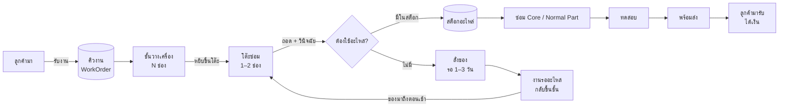

# REPAIR_SHOP_SYSTEM.md — ระบบร้านซ่อมของขม (จัดการ Scene · คิวงาน · ชั้นวางเครื่อง · สต็อกอะไหล่ · สั่งของ)

> [Claude 4 ต.ค. 2569] · เขียนจากโค้ดจริงที่ commit `09f7491` · ใช้คู่กับ `GAME_LOOP.md` (ลูปวัน/รอบ) และ `REPAIR_FLOW.md` (งานซ่อม 1 งาน + สเปก `PartDef` / `CustomerCase` / `ToolDef`)
> **คำศัพท์ในเอกสารนี้:** **ร้านซ่อม** = ร้านบักช่างขม (Workshop · ที่ผู้เล่นรับงานและซ่อม) · **ร้านค้า** = ที่ผู้เล่นไปซื้อของ (ตลาดหมู่บ้าน `Market` · ร้านออนไลน์ในเมือง) — ชื่อคลาสใช้ `Workshop…` กับ `Supply…` แยกกันชัดเจน ไม่ใช้คำว่า Shop เดี่ยว ๆ
>
> เอกสารนี้ตอบ 2 เรื่องที่ทีมกำลังตัดสินใจ: **(1) จะ handle แต่ละ scene ยังไง** · **(2) ถ้าอยากให้เป็นเกมร้านจริง ต้องมีระบบอะไรบ้าง** (คอมหลายเครื่องพร้อมกัน · ของเสียต้องสั่งอะไหล่)

---

## ส่วนที่ 1 · จัดการ Scene

### 1.1 ตอนนี้ใช้ 3 วิธีปนกัน

| วิธี | ใช้ที่ | ข้อเสีย |
|---|---|---|
| `change_scene_to_file()` | หน้าเริ่ม → บ้าน · บ้าน ↔ ห้อง (`door.gd`) | ซีนเก่าถูกลบทิ้ง ค่าในซีนหายหมด · ต้องเก็บ state ไว้ที่ autoload เท่านั้น |
| autoload ที่ซ่อน/โชว์ | ตลาด (`Market` autoload + `process_mode` DISABLED) · แผนที่ (`MapPanel`) | ตลาดอยู่ในหน่วยความจำตลอดเกม · ซ้อนกับซีนปัจจุบันจนต้อง `move_to_front()` |
| `add_child` ใส่ซีนปัจจุบัน | มินิเกมทั้งหมด (`EventManager._process_data`) | ถ้าเปลี่ยนซีนระหว่างมินิเกม มินิเกมหายไปด้วย · คลิกทะลุได้ถ้าไม่มีฉากหลังกัน (BUG-16) |

ทำงานได้ แต่พอเพิ่มร้าน โต๊ะซ่อม ชั้นวางเครื่อง หน้าสั่งของ จะเริ่มงงว่าแต่ละหน้าเปิดด้วยวิธีไหน และกด "กลับ" แล้วไปไหน

### 1.2 ทางเลือก

| | A · `change_scene` ทุกที่ | **B · GameRoot + Router + Stack (แนะนำ)** | C · ทุกอย่างเป็น autoload ซ่อน/โชว์ |
|---|---|---|---|
| วิธี | ทุกหน้าเป็นไฟล์ซีน เปลี่ยนทั้งจอ | มีซีนแม่ตัวเดียวไม่ถูกลบ · สลับ "สถานที่" ในช่องเดียว · หน้าที่เปิดทับ (มินิเกม · ชั้นวาง · สั่งของ · สรุป) ซ้อนเป็น stack | ทุกหน้าโหลดค้างไว้ตั้งแต่เปิดเกม |
| state | ต้องอยู่ใน autoload | อยู่ใน autoload + ซีนที่เปิดทับยังอยู่ระหว่างกด "กลับ" | อยู่ในซีนเองได้ |
| ปุ่ม "กลับ" | ต้องจำเองว่ามาจากไหน | `pop()` ออกจาก stack อัตโนมัติ | เขียนเองทุกหน้า |
| หน่วยความจำ | ต่ำ | ต่ำ (โหลดเฉพาะสถานที่ปัจจุบัน) | สูง ภาพทุกฉากค้าง |
| แก้ BUG-16 / มินิเกมหาย | ไม่ | ได้ (มินิเกมอยู่ใน Overlay ไม่ใช่ใต้สถานที่) | ได้บางส่วน |
| งานที่ต้องย้าย | น้อย | ปานกลาง (เปลี่ยน `door.gd` / `map` / `EventManager` ให้เรียก Router) | มาก |

**แนะนำ B** — เกมร้านซ่อมมีหน้าที่ "เปิดทับแล้วกลับมาที่เดิม" เยอะมาก (ดูชั้นวาง → หยิบเครื่อง → มินิเกม → สรุป → กลับโต๊ะ) stack ทำให้ปุ่มกลับทำงานเองถูกทุกครั้ง

### 1.3 โครง B

```
GameRoot (Node · main scene ถาวรหลังกด Start)
├── LocationSlot      ← สถานที่เดียวที่เปิดอยู่ (Home / Room / Workshop / Workbench / Market / Village)
├── OverlayStack      ← CanvasLayer layer 10 · หน้าที่เปิดทับ ซ้อนกันได้ (push / pop)
│                        มินิเกม Core Part · ชั้นวางเครื่อง · สั่งอะไหล่ · การ์ดสรุป · สมุดจด
└── Fade              ← CanvasLayer layer 30 · จอดำตอนเปลี่ยนสถานที่
autoload: Global · EventManager (มี TimeSystem · QuestBoard · Tutorial เป็นลูก · layer 100 = HUD) · DialogScene · SceneRouter · GameState · (WorkshopManager · Inventory · SupplyOrders ส่วนที่ 2)
```

**ไม่มี HUD ใน GameRoot — HUD คือลูกของ `EventManager` อยู่แล้ว** (`TimeSystem` + `QuestBoard` เป็น `CanvasLayer` layer 100 ใน `Scene/event_manager.tscn`) จึงอยู่เหนือ Overlay (10) และ Fade (30) ตลอด · เหตุผลที่ไม่ย้ายออกไปเป็นโหนดแยกใน GameRoot:
- `EventManager` เรียก `time_system` / `questboard` / `tutorial` ตรง ๆ ผ่าน `@onready $"…"` (ความสัมพันธ์ พ่อ→ลูก ชัดเจน) · ถ้าแยกออกไปต้องเปลี่ยนเป็น signal หรือหาโหนดผ่าน `SceneRouter.root` ซึ่งเพิ่มความซับซ้อนโดยไม่จำเป็น และ `GameRoot` ยังไม่มีตอน `EventManager._ready`
- `EventManager` ไม่ได้มีแค่ UI (event map · เดินเควสต์ · เปิด dialog · ส่งมินิเกม) จึง**ไม่เปลี่ยนชื่อเป็น `HUD`** (แตะ ~71 จุดและชื่อบอกไม่ครบ) · ถ้าอยากรวมการโชว์/ซ่อน HUD ไว้จุดเดียวค่อยเพิ่มเมธอดบน `EventManager` (ตั้ง `visible` ของ `TimeSystem` + `QuestBoard`) ตาม `QuestStep.showHUD`
- ถ้าอนาคตอยากแยก HUD ที่แสดงอย่างเดียว (เวลา · เงิน · เควสต์) ออกจาก logic ให้ทำหลัง Router เสร็จ ไม่ใช่ส่วนของงานนี้

| ชั้น | อะไรอยู่ | เปิดยังไง | ปิดยังไง |
|---|---|---|---|
| Location | ที่ที่ผู้เล่นยืนอยู่ ณ ตอนนั้น 1 ที่ | `SceneRouter.go(&"workshop")` — ลบที่เก่า โหลดที่ใหม่ เฟดดำ | เปลี่ยนที่ |
| Overlay | หน้าที่ทำเสร็จแล้วต้องกลับมาที่เดิม | `SceneRouter.push(scene, ctx)` | `SceneRouter.pop(result)` หรือปุ่มกลับ |
| HUD (`EventManager`) / Dialog / PibHint | อยู่ตลอด (autoload · layer 100) | ซ่อน/โชว์ตาม `QuestStep.showHUD` | — |

กติกา:
- **state ของเกมอยู่ใน autoload เท่านั้น** (`GameState` · `WorkshopManager` ฯลฯ) ซีนแค่ "แสดง" state — เปลี่ยนซีนแล้วไม่มีอะไรหาย และ Save ง่ายเพราะ save แค่ autoload
- ระหว่างมี Overlay เปิด Location ถูก `process_mode = DISABLED` + มีฉากหลังกันคลิก → จบ BUG-16
- มินิเกม Core Part เปิดผ่าน `push()` เสมอ (ทั้งจากเควสต์และจากโต๊ะซ่อม) ผลส่งกลับผ่าน `pop(result)`

### 1.4 สเกลตันโค้ด

```gdscript
# Scripts/Core/scene_router.gd  (autoload: SceneRouter)
extends Node

signal location_changed(id: StringName)
signal overlay_closed(scene_path: String, result: Variant)

const LOCATIONS := {
	&"home": "res://Scene/Location/Home.tscn",
	&"room": "res://Scene/Location/Room.tscn",
	&"workshop": "res://Scene/Location/Workshop.tscn",
	&"workbench": "res://Scene/Location/Workbench.tscn",
	&"market": "res://Scene/Location/Market.tscn",
}

var root: Node              # GameRoot ตั้งค่าตัวเองตอน _ready
var current_id: StringName
var _stack: Array[Node] = []

func go(id: StringName) -> void:
	while not _stack.is_empty():
		pop(null)                         # ปิด overlay ทั้งหมดก่อนย้ายที่
	await root.fade_out()
	for c in root.location_slot.get_children():
		c.queue_free()
	root.location_slot.add_child(load(LOCATIONS[id]).instantiate())
	current_id = id
	GameState.location = id
	location_changed.emit(id)
	await root.fade_in()

func push(path: String, ctx: Variant = null) -> Node:
	var n: Node = load(path).instantiate()
	n.set_meta("ctx", ctx)                # มินิเกมอ่าน ctx เช่น WorkOrder ที่กำลังซ่อม
	if _stack.is_empty():
		_set_location_paused(true)
	else:
		_stack.back().process_mode = Node.PROCESS_MODE_DISABLED
	_stack.append(n)
	root.overlay_stack.add_child(n)
	return n

func pop(result: Variant = null) -> void:
	if _stack.is_empty():
		return
	var n: Node = _stack.pop_back()
	var path := n.scene_file_path
	n.queue_free()
	if _stack.is_empty():
		_set_location_paused(false)
	else:
		_stack.back().process_mode = Node.PROCESS_MODE_INHERIT
	overlay_closed.emit(path, result)

func _set_location_paused(on: bool) -> void:
	for c in root.location_slot.get_children():
		c.process_mode = Node.PROCESS_MODE_DISABLED if on else Node.PROCESS_MODE_INHERIT
```

ต่อกับของเดิม:
- `EventManager._process_data()` ช่อง `MINIGAME` → `SceneRouter.push(data.scene_path)` แทน `current_scene.add_child`
- `PartMinigame._on_minigame_finished` → `SceneRouter.pop(score)` แทน `queue_free()` + `minigame_end()` (EventManager ฟัง `overlay_closed` แทน)
- `door.gd` · `Map/*.gd` → `SceneRouter.go(&"room")` ฯลฯ · ตลาดเลิกเป็น autoload

---

## ส่วนที่ 2 · ระบบร้านซ่อม (ให้เหมือนเกมจัดการร้าน)

### 2.1 ภาพรวม



### 2.2 คิวงาน (WorkOrder) — หัวใจของระบบ

คอม 1 เครื่อง = 1 `WorkOrder` · ลูกค้ามาหลายคน = หลาย WorkOrder อยู่พร้อมกัน

| สถานะ | ความหมาย | อยู่ที่ไหนในเกม |
|---|---|---|
| `WAITING` | รับเครื่องแล้ว ยังไม่ได้แตะ | ชั้นวางเครื่อง |
| `ON_BENCH` | กำลังถอด/วินิจฉัย | โต๊ะซ่อม |
| `WAITING_PARTS` | รู้สาเหตุแล้ว แต่ไม่มีอะไหล่ · สั่งแล้วรอของ | ชั้นวาง (ติดป้ายส้ม "รออะไหล่") |
| `REPAIRING` | ทำมินิเกม/งานสั้นอยู่ | โต๊ะซ่อม |
| `READY` | ซ่อมเสร็จ ทดสอบผ่าน | ชั้น "พร้อมส่ง" หน้าร้าน |
| `PICKED_UP` | ลูกค้ามารับ จ่ายเงินแล้ว | ปิดงาน → บันทึกคะแนน |
| `ABANDONED` | เกินกำหนดจนลูกค้าทวงคืน/ยกเลิก | ความพอใจลดหนัก |

ใช้ **list + เรียงตามกำหนดส่ง** (ไม่ใช่ stack) — งานที่ใกล้กำหนดขึ้นก่อน ผู้เล่นเลือกหยิบเองได้

```gdscript
# Scripts/Workshop/work_order.gd
class_name WorkOrder extends Resource

enum Status { WAITING, ON_BENCH, WAITING_PARTS, REPAIRING, READY, PICKED_UP, ABANDONED }

@export var id: int
@export var case_id: StringName            # อ้าง CustomerCase (REPAIR_FLOW 8.1)
@export var customer_name: String
@export var device_label: String           # "คอมตั้งโต๊ะ ป้า ๆ บ้านท้ายซอย"
@export var status: Status = Status.WAITING
@export var day_received: int
@export var due_day: int                   # ลูกค้าจะมารับวันไหน
@export var fault_parts: Array[StringName] # Part ที่เสียจริง (รู้ตอนวินิจฉัย)
@export var parts_needed: Dictionary       # part_id → จำนวน ที่ต้องเปลี่ยน
@export var removed_parts: Array[StringName] = []
@export var score := -1                    # คะแนนจากมินิเกม (−1 = ยังไม่ทำ)
@export var fee_quoted := 0                # ราคาที่บอกลูกค้าตอนรับ
@export var note := ""
```

### 2.3 ความจุ = ตัวสร้างความกดดัน

| ทรัพยากร | เริ่ม | อัปเกรด | ถ้าเต็ม |
|---|---|---|---|
| ชั้นวางเครื่อง | 3 ช่อง | ซื้อชั้นเพิ่ม → 5 → 8 | ปฏิเสธลูกค้าใหม่ (เสียโอกาส) หรือรับแล้ววางพื้น (ความพอใจ −) |
| โต๊ะซ่อม | 1 ช่อง | โต๊ะตัวที่ 2 (รอบ 6+) | ต้องเก็บเครื่องที่ทำค้างลงชั้นก่อนหยิบเครื่องใหม่ |
| แรงงานต่อวัน | ช่วงเที่ยง 1 ช่วง = ทำมินิเกมได้ ~2 งาน | มิ้นมาช่วยร้าน (เนื้อเรื่อง) → +1 งาน/วัน | งานที่เหลือเลื่อนไปวันถัดไป |

### 2.4 สต็อกอะไหล่ + สั่งของ

| ระบบ | ข้อมูล | ใช้ตอน |
|---|---|---|
| **Inventory** | `part_id → จำนวน` · เครื่องมือที่มี · ของสิ้นเปลือง (ซิลิโคน · IPA · เคเบิลไท) | มินิเกมเช็กก่อนให้ใช้ · ใช้แล้วหัก |
| **Catalog** (`SupplyItem.tres`) | ราคา · วันส่ง · ร้านที่ขาย (ตลาดหมู่บ้าน = ได้ทันทีแต่แพง/ของน้อย · สั่งออนไลน์จากเมือง = ถูกกว่าแต่รอ 2–3 วัน) | หน้าสั่งของ |
| **SupplyOrders** | รายการสั่งที่ยังไม่มาถึง `{item, qty, arrive_day, for_order_id}` | เช้าวันใหม่ → ของถึง → งานที่รออะไหล่กลับเป็น `ON_BENCH` ได้ |

ของที่ "เสียเพิ่ม" ระหว่างซ่อมใช้กติกาเดียวกัน — มินิเกมที่มีอยู่แล้วมีจุดทำของเสีย:

| มินิเกม | ทำเสียได้ | ผล |
|---|---|---|
| GPU | ฝืนเสียบหัว CPU 8-pin → การ์ดไหม้ (`card_burnt`) | ต้องมี/สั่งการ์ดจอใหม่ · หักเงินค่าการ์ดจากค่าซ่อม |
| Mainboard | กด CPU ตอนหันผิด → ขาซ็อกเก็ตงอ | ต้องมี/สั่งเมนบอร์ดสำรอง |
| BIOS | ลง Windows ทับ HDD ลูกค้า (`data_lost`) | ไม่มีอะไหล่แทนได้ → ความพอใจลดหนัก |
| RAM | ใช้ไดร์/เครื่องดูดฝุ่น → แรมเสียหาย | ต้องมี/สั่งแรมใหม่ |

### 2.5 วันหนึ่งของร้าน (ต่อจาก `GAME_LOOP.md` ข้อ 3)

| ช่วง | ระบบทำอะไร |
|---|---|
| เริ่มวัน | `SupplyOrders.deliver(day)` ของที่สั่งมาถึง · `WorkshopManager.check_due(day)` งานเกินกำหนด → ลูกค้าโทรทวง / ยกเลิก |
| เช้า | ลูกค้าใหม่ 1–3 คน (ตามรอบ + ชื่อเสียง) · คนที่นัดรับ `READY` มารับ → จ่ายเงิน |
| เที่ยง | หยิบงานจากชั้นขึ้นโต๊ะ → วินิจฉัย → Core Part (push มินิเกม) → ใช้/สั่งอะไหล่ |
| เย็น | หมู่บ้าน · ตลาด (ซื้อของได้ทันที) · หน้าสั่งของออนไลน์ |
| จบวัน | สรุป: งานเสร็จ · เงินเข้า-ออก · ของที่รอ · autosave |

### 2.6 Autoload ที่ต้องมี (state ทั้งหมดอยู่ตรงนี้ → Save ง่าย)

| Autoload | เก็บ | สัญญาณหลัก |
|---|---|---|
| `GameState` | `week` · `day` · `period` · `location` · `money` · `reputation` · `story_flags` | `money_changed` · `day_started` |
| `WorkshopManager` | `orders: Array[WorkOrder]` · `shelf_slots` · `bench: Array[int]` (id ที่อยู่บนโต๊ะ) · `next_id` | `order_added` · `order_status_changed` |
| `Inventory` | `parts: Dictionary` · `tools: Array` · `consumables: Dictionary` | `stock_changed` |
| `SupplyOrders` | `pending: Array[Dictionary]` · `catalog: Array[SupplyItem]` | `order_placed` · `delivery_arrived` |
| `SaveManager` | อ่าน/เขียน 4 ตัวบนเป็น JSON (`user://save_1.json`) | — |
| (มีแล้ว) `EventManager` | เควสต์หลัก | — |

> `RepairManager` ใน `REPAIR_FLOW.md` 8.2 = state ของ **งานที่อยู่บนโต๊ะตอนนี้** (ชิ้นที่ถอดแล้ว · เบาะแส) — ให้มันอ่าน/เขียน `WorkOrder` ตัวที่อยู่บนโต๊ะ แทนการเก็บ state ซ้ำ

```gdscript
# Scripts/Workshop/workshop_manager.gd  (autoload: WorkshopManager)
extends Node

signal order_added(o: WorkOrder)
signal order_status_changed(o: WorkOrder)

var orders: Array[WorkOrder] = []
var shelf_slots := 3
var bench_slots := 1
var next_id := 1

func can_accept() -> bool:
	return waiting_on_shelf().size() < shelf_slots

func accept(case_id: StringName, customer: String, due_in_days: int, fee: int) -> WorkOrder:
	var o := WorkOrder.new()
	o.id = next_id; next_id += 1
	o.case_id = case_id; o.customer_name = customer
	o.day_received = GameState.day; o.due_day = GameState.day + due_in_days
	o.fee_quoted = fee
	orders.append(o)
	order_added.emit(o)
	return o

func waiting_on_shelf() -> Array[WorkOrder]:
	return orders.filter(func(o): return o.status in [WorkOrder.Status.WAITING, WorkOrder.Status.WAITING_PARTS])

func set_status(o: WorkOrder, s: WorkOrder.Status) -> void:
	o.status = s
	order_status_changed.emit(o)

## ซ่อมเสร็จ: ใช้คะแนนจากหน้าสรุปมินิเกม (0–100)
func finish_repair(o: WorkOrder, score: int) -> void:
	o.score = score
	set_status(o, WorkOrder.Status.READY)
```

```gdscript
# Scripts/Workshop/supply_orders.gd  (autoload: SupplyOrders)
extends Node

signal delivery_arrived(item_id: StringName, qty: int)

var pending: Array[Dictionary] = []   # {item, qty, arrive_day, for_order}

func place(item: SupplyItem, qty: int, for_order := -1) -> bool:
	var cost := item.price * qty
	if GameState.money < cost:
		return false
	GameState.add_money(-cost)
	pending.append({"item": item.id, "qty": qty, "arrive_day": GameState.day + item.delivery_days, "for_order": for_order})
	return true

func deliver(day: int) -> void:
	for p in pending.duplicate():
		if p.arrive_day <= day:
			Inventory.add(p.item, p.qty)
			pending.erase(p)
			delivery_arrived.emit(p.item, p.qty)
```

```gdscript
# Scripts/Resources/supply_item.gd
class_name SupplyItem extends Resource

@export var id: StringName             # "ram_ddr4_8g" · "gpu_gtx1650" · "thermal_paste"
@export var display_name: String
@export var icon: Texture2D
@export var price := 0
@export var delivery_days := 0         # 0 = ตลาดหมู่บ้าน ได้ทันที
@export var unlock_week := 1           # ปลดล็อกตามรอบ (ตาม Core Part ที่ปลดล็อก)
```

### 2.7 มินิเกมต้องรู้อะไรจาก WorkOrder

ตอนนี้มินิเกมเล่นแบบ standalone (สภาพเครื่องตายตัวใน `_setup()`) — พอมีคิวงาน ให้ส่ง WorkOrder เข้าไปเป็น `ctx`:

| อ่านจาก ctx | ใช้ทำ |
|---|---|
| `case_id` | เลือกสภาพเริ่มต้น (เช่น GPU: การ์ดไม่ได้ต่อไฟ vs พัดลมหลังกลับทิศ) |
| `Inventory` | เช็กว่ามีของให้เปลี่ยนไหม (การ์ดใหม่ · ซิลิโคน · IPA) ถ้าไม่มี → ปุ่ม "สั่งของ" แล้วเก็บงานเป็น `WAITING_PARTS` |
| ส่งกลับตอน `pop(result)` | `{score, broken: [part_id...], used: {item: qty}}` → `WorkshopManager.finish_repair` / สร้างรายการต้องสั่ง |

ไม่ต้องแก้ phase ที่มีอยู่ — เพิ่มแค่ `_setup()` อ่าน `get_meta("ctx")` และหน้า SUMMARY ส่งผลกลับ

### 2.8 หน้าจอใหม่ (ตาม storyboard กรอบ 01–05)

| หน้า | ชั้น | เนื้อหา |
|---|---|---|
| Workshop (หน้าร้านซ่อม) | Location | เคาน์เตอร์ · ลูกค้า · **ชั้นพร้อมส่ง** (เครื่อง READY มีป้ายชื่อ) |
| Workbench (หลังร้าน) | Location | โต๊ะ 1–2 ช่อง · **ชั้นวางเครื่อง** (WAITING / WAITING_PARTS) · คลิกเครื่องบนชั้น = หยิบขึ้นโต๊ะ |
| ShelfPanel | Overlay | รายการงานทั้งหมด: ลูกค้า · อาการ · กำหนดส่ง (เหลือกี่วัน สีส้มเมื่อใกล้) · สถานะ |
| SupplyPanel | Overlay | สั่งของจากร้านค้า: แคตตาล็อก · ตะกร้า · ของที่รอส่ง (มาถึงวันไหน) |
| Core Part | Overlay | มินิเกมเดิม |
| DaySummary | Overlay | การ์ดสรุปวัน (storyboard กรอบ 08) |

ภาพที่ต้องวาดเพิ่ม (Claude วาด): ชั้นวางเครื่อง · เครื่องบนชั้น 3 แบบ (ตั้งโต๊ะ · โน้ตบุ๊ก · ออลอินวัน) · ป้ายสถานะ 3 สี · กล่องพัสดุ · ไอคอนอะไหล่ในแคตตาล็อก

---

## ส่วนที่ 3 · ลำดับทำ (MVP ก่อน)

1. **SceneRouter + GameRoot** — ย้ายมินิเกมไป Overlay ก่อน (แก้ BUG-16 ไปด้วย) แล้วค่อยย้ายประตู/แผนที่
2. **GameState** (วัน/รอบ/เงิน) + **SaveManager** แบบง่าย
3. **WorkshopManager + WorkOrder** — เริ่มจาก 1 โต๊ะ 3 ช่องชั้น · ลูกค้ามาวันละ 1–2 คนจาก `CustomerCase` 5 เคส (1 เคสต่อ Core Part)
4. หน้า **Workbench + ShelfPanel** → หยิบงาน → push มินิเกม → `finish_repair`
5. **Inventory + SupplyOrders + SupplyPanel** — เริ่มจากของ 6 อย่าง: แรม · การ์ดจอ · เมนบอร์ด · ซิลิโคน · IPA · เคเบิลไท
6. เชื่อม "ทำของเสียในมินิเกม" → ต้องสั่งอะไหล่
7. อัปเกรดร้าน (ชั้นเพิ่ม · โต๊ะที่ 2) + ลูกค้าตามชื่อเสียง

## ประวัติเอกสาร

| วันที่ | การเปลี่ยนแปลง |
|---|---|
| 7 ต.ค. 2569 | 1.3: เอา `HUD` ออกจาก `GameRoot` — HUD คือลูกของ `EventManager` (autoload) อยู่แล้ว เรียกกันตรง ๆ ไม่ต้องใช้ signal · ไม่เปลี่ยนชื่อ `EventManager` · แก้เลข layer เป็นค่าจริง (100) |
| 4 ต.ค. 2569 | เปลี่ยนชื่อจาก `SHOP_SYSTEMS.md` → `REPAIR_SHOP_SYSTEM.md` · แยกคำว่าร้านซ่อม (Workshop) กับร้านค้า (Supply/Market) |
| 4 ต.ค. 2569 | สร้างเอกสาร — ทางเลือกจัดการ scene (แนะนำ Router + Overlay stack) + ระบบคิวงาน/ชั้นวาง/สต็อก/สั่งของ |
